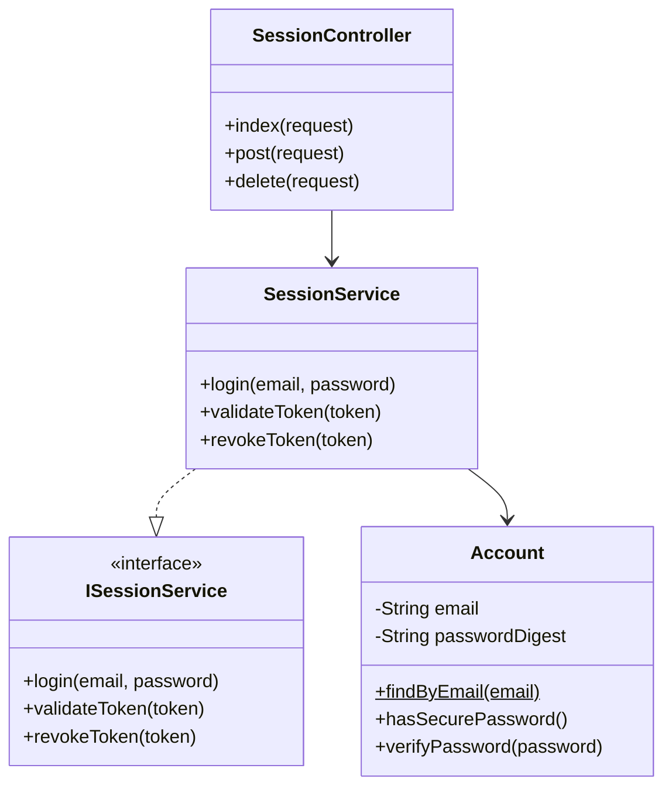
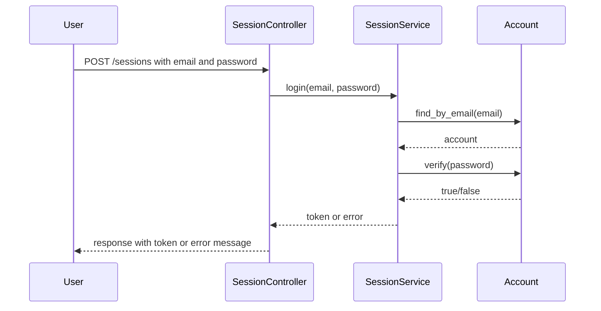
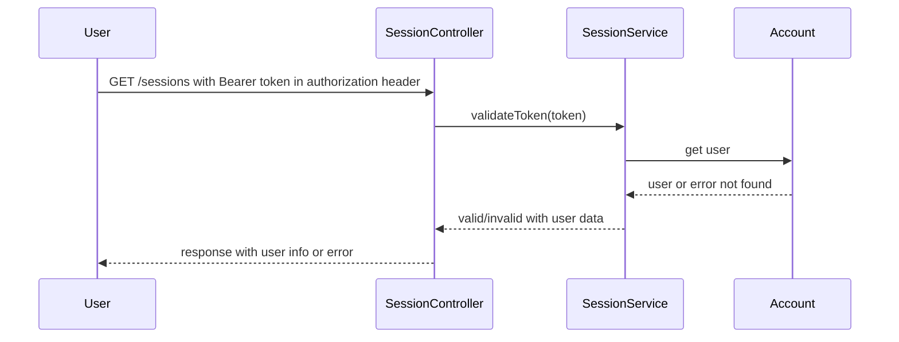

# Authentification Composant
## Description
This component is responsible for handling user Session in the application. It provides functionalities for user login.

## Features for other components
- User login with email and password
- Bearer token generation for authenticated sessions
- Validation of user credentials

## Diagram

## Sequence
### User Login Sequence

### Token Validation Sequence

