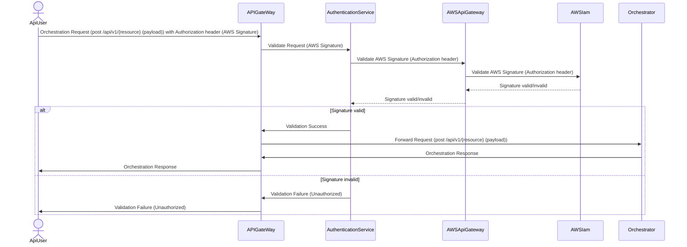

```mermaid
sequenceDiagram
  actor ApiUser
  participant APIGateWay
  participant AuthenticationService
  participant AWSApiGateway
  participant AWSIam
  participant Orchestrator

  ApiUser->>APIGateWay: Orchestration Request (post /api/v1/{resource} (payload)) with Authorization header (AWS Signature)
  APIGateWay->>AuthenticationService: Validate Request (AWS Signature)
  AuthenticationService->>AWSApiGateway: Validate AWS Signature (Authorization header)
  AWSApiGateway->>AWSIam: Validate AWS Signature (Authorization header)
  AWSIam-->>AWSApiGateway: Signature valid/invalid 
  AWSApiGateway-->>AuthenticationService: Signature valid/invalid
  alt Signature valid
    AuthenticationService->>APIGateWay: Validation Success
    APIGateWay->>Orchestrator: Forward Request (post /api/v1/{resource} (payload))
    Orchestrator->>APIGateWay: Orchestration Response
    APIGateWay->>ApiUser: Orchestration Response
  else Signature invalid
    AuthenticationService->>APIGateWay: Validation Failure (Unauthorized)
    APIGateWay->>ApiUser: Validation Failure (Unauthorized)
  end
```