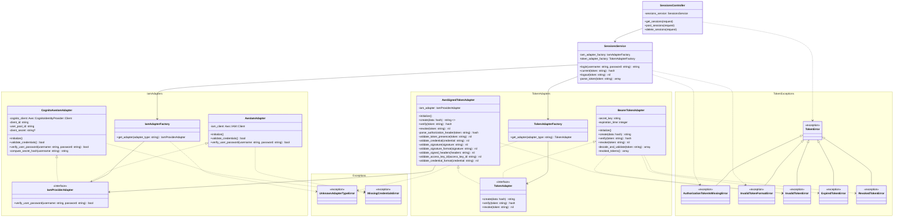

```mermaid
classDiagram
  namespace IamAdapters {
    class IamProviderAdapter {
      <<interface>>
      +verify_user_password(username: string, password: string) bool
    }

    class AwsIamAdapter {
      -iam_client: Aws::IAM::Client
      +initialize()
      +validate_credentials() bool
      +verify_user_password(username: string, password: string) bool
    }

    class CognitoAwsIamAdapter {
      -cognito_client: Aws::CognitoIdentityProvider::Client
      -client_id: string
      -user_pool_id: string
      -client_secret: string?
      +initialize()
      +validate_credentials() bool
      +verify_user_password(username: string, password: string) bool
      -compute_secret_hash(username: string) string
    }

    class IamAdapterFactory {
      +get_adapter(adapter_type: string) IamProviderAdapter
    }
  }

  namespace TokenAdapters {
    class TokenAdapter {
      <<interface>>
      +create(data: hash) string
      +verify(token: string) hash
      +revoke(token: string) nil
    }

    class BearerTokenAdapter {
      -secret_key: string
      -expiration_time: integer
      +initialize()
      +create(data: hash) string
      +verify(token: string) hash
      +revoke(token: string) nil
      -decode_and_validate(token: string) array
      -revoked_tokens() array
    }

    class AwsSignedTokenAdapter {
      -iam_adapter: IamProviderAdapter
      +initialize()
      +create(data: hash) string <<raises NotImplementedError>>
      +verify(token: string) hash
      +revoke(token: string) nil
      -parse_authorization_header(token: string) hash
      -validate_token_presence(token: string) nil
      -validate_credential(credential: string) nil
      -validate_signature(signature: string) nil
      -validate_signature_format(signature: string) nil
      -validate_signed_headers(headers: string) nil
      -validate_access_key_id(access_key_id: string) nil
      -validate_credential_format(credential: string) nil
    }

    class TokenAdapterFactory {
      +get_adapter(adapter_type: string) TokenAdapter
    }
  }

  class SessionsService {
    -iam_adapter_factory: IamAdapterFactory
    -token_adapter_factory: TokenAdapterFactory
    +login(username: string, password: string) string
    +current(token: string) hash
    +logout(token: string) nil
    -parse_token(token: string) array
  }

  class SessionsController {
    -sessions_service: SessionsService
    +get_sessions(request)
    +post_sessions(request)
    +delete_sessions(request)
  }

  namespace Exceptions {
    class UnknownAdapterTypeError {
      <<exception>>
    }

    class MissingCredentialsError {
      <<exception>>
    }
  }

  namespace TokenExceptions {
    class TokenError {
      <<exception>>
    }

    class AuthorizationTokenIsMissingError {
      <<exception>>
    }

    class InvalidTokenFormatError {
      <<exception>>
    }

    class InvalidTokenError {
      <<exception>>
    }

    class ExpiredTokenError {
      <<exception>>
    }

    class RevokedTokenError {
      <<exception>>
    }
  }

  SessionsController --> SessionsService
  SessionsService --> IamAdapterFactory
  SessionsService --> TokenAdapterFactory

  IamAdapterFactory --> IamProviderAdapter
  TokenAdapterFactory --> TokenAdapter

  AwsIamAdapter <|.. IamProviderAdapter
  CognitoAwsIamAdapter <|.. IamProviderAdapter
  BearerTokenAdapter <|.. TokenAdapter
  AwsSignedTokenAdapter <|.. TokenAdapter

  AwsSignedTokenAdapter --> IamProviderAdapter

  AwsIamAdapter ..> MissingCredentialsError
  CognitoAwsIamAdapter ..> MissingCredentialsError
  IamAdapterFactory ..> UnknownAdapterTypeError
  TokenAdapterFactory ..> UnknownAdapterTypeError

  TokenError <|-- AuthorizationTokenIsMissingError
  TokenError <|-- InvalidTokenFormatError
  TokenError <|-- InvalidTokenError
  TokenError <|-- ExpiredTokenError
  TokenError <|-- RevokedTokenError

  SessionsService ..> AuthorizationTokenIsMissingError
  SessionsService ..> InvalidTokenFormatError

  BearerTokenAdapter ..> InvalidTokenError
  BearerTokenAdapter ..> ExpiredTokenError
  BearerTokenAdapter ..> RevokedTokenError
  AwsSignedTokenAdapter ..> InvalidTokenError

  SessionsController ..> TokenError
```
