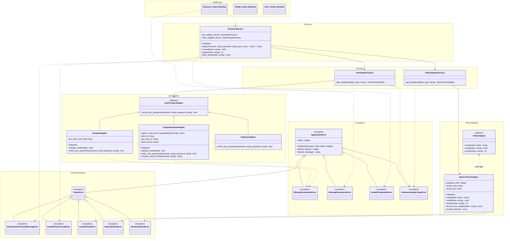

```mermaid
classDiagram
  namespace Services {
    class SessionsService {
      -iam_adapter_factory: IamAdapterFactory
      -token_adapter_factory: TokenAdapterFactory
      +initialize()
      +login(username: string, password: string, type: string = "auth") string
      +current(token: string) hash
      +logout(token: string) nil
      -parse_token(token: string) array
    }
  }

  namespace Factories {
    class IamAdapterFactory {
      +get_adapter(adapter_type: string) IamProviderAdapter
    }

    class TokenAdapterFactory {
      +get_adapter(adapter_type: string) BearerTokenAdapter
    }
  }

  namespace IamAdapters {
    class IamProviderAdapter {
      <<abstract>>
      +verify_user_password(username: string, password: string) bool
    }

    class AwsIamAdapter {
      -iam_client: Aws::IAM::Client
      +initialize()
      +validate_credentials() bool
      +verify_user_password(username: string, password: string) bool
    }

    class CognitoAwsIamAdapter {
      -cognito_client: Aws::CognitoIdentityProvider::Client
      -client_id: string
      -user_pool_id: string
      -client_secret: string?
      +initialize()
      +validate_credentials() bool
      +verify_user_password(username: string, password: string) bool
      -compute_secret_hash(username: string) string
    }

    class FakeIamAdapter {
      +verify_user_password(username: string, password: string) bool
    }
  }

  namespace TokenAdapters {
    class TokenAdapter {
      <<abstract>>
      +create(data: hash) string
      +verify(token: string) hash
      +revoke(token: string) nil
    }

    class BearerTokenAdapter {
      -expiration_time: integer
      -random_key: string
      -secret_key: string
      +initialize()
      +create(data: hash) string
      +verify(token: string) hash
      +revoke(token: string) nil
      -decode_and_validate(token: string) array
      -revoked_tokens() array
    }
  }

  namespace Exceptions {
    class ApplicationError {
      <<exception>>
      +status: integer
      +initialize(message: string, status: integer)
      +default_status() integer
      +default_message() string
    }

    class MissingCredentialsError {
      <<exception>>
    }

    class MissingParametersError {
      <<exception>>
    }

    class InvalidCredentialsError {
      <<exception>>
    }

    class UnknownAdapterTypeError {
      <<exception>>
    }
  }

  namespace TokenExceptions {
    class TokenError {
      <<exception>>
    }

    class AuthorizationTokenIsMissingError {
      <<exception>>
    }

    class InvalidTokenFormatError {
      <<exception>>
    }

    class InvalidTokenError {
      <<exception>>
    }

    class ExpiredTokenError {
      <<exception>>
    }

    class RevokedTokenError {
      <<exception>>
    }
  }

  namespace HttpRoutes {
    class SessionsRoutes["Sessions routes (Sinatra)"]
    class HealthRoutes["Health routes (Sinatra)"]
    class DocsRoutes["Docs routes (Sinatra)"]
  }

  SessionsRoutes ..> SessionsService

  SessionsService --> IamAdapterFactory
  SessionsService --> TokenAdapterFactory

  IamAdapterFactory --> IamProviderAdapter
  TokenAdapterFactory --> BearerTokenAdapter

  IamProviderAdapter <|-- AwsIamAdapter
  IamProviderAdapter <|-- CognitoAwsIamAdapter
  IamProviderAdapter <|-- FakeIamAdapter

  TokenAdapter <.. BearerTokenAdapter : duck type

  ApplicationError <|-- MissingCredentialsError
  ApplicationError <|-- MissingParametersError
  ApplicationError <|-- InvalidCredentialsError
  ApplicationError <|-- UnknownAdapterTypeError
  ApplicationError <|-- TokenError

  TokenError <|-- AuthorizationTokenIsMissingError
  TokenError <|-- InvalidTokenFormatError
  TokenError <|-- InvalidTokenError
  TokenError <|-- ExpiredTokenError
  TokenError <|-- RevokedTokenError

  AwsIamAdapter ..> MissingCredentialsError
  CognitoAwsIamAdapter ..> MissingCredentialsError
  IamAdapterFactory ..> UnknownAdapterTypeError
  TokenAdapterFactory ..> UnknownAdapterTypeError
  SessionsService ..> InvalidCredentialsError
  SessionsService ..> AuthorizationTokenIsMissingError
  SessionsService ..> InvalidTokenFormatError
  BearerTokenAdapter ..> InvalidTokenError
  BearerTokenAdapter ..> ExpiredTokenError
  BearerTokenAdapter ..> RevokedTokenError
  SessionsRoutes ..> MissingParametersError
```
