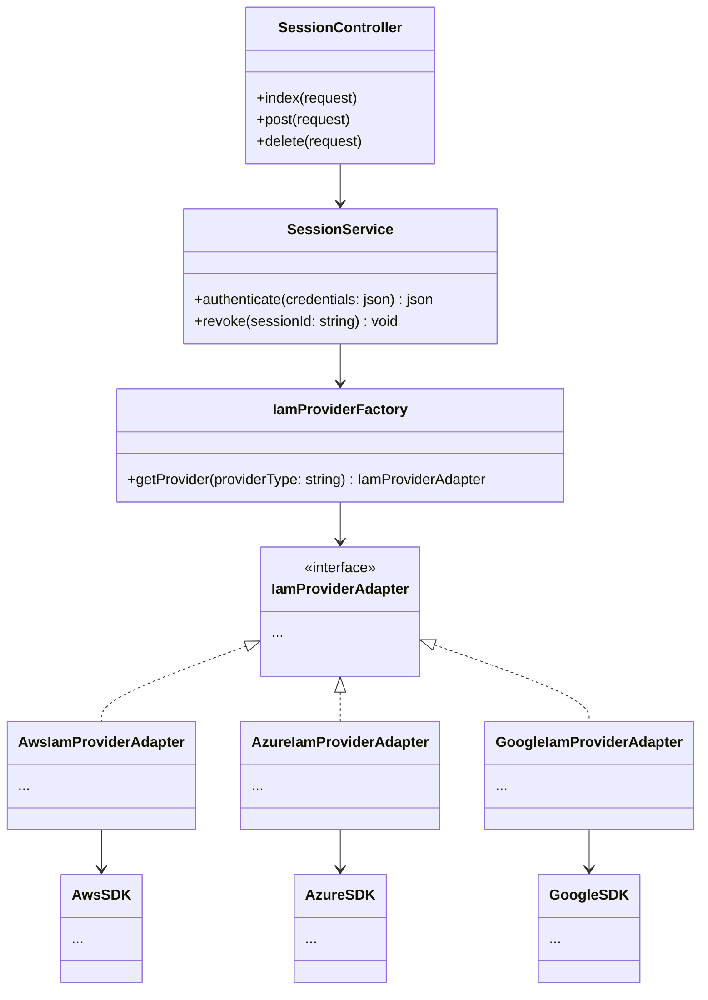

```mermaid
classDiagram
  class IamProviderAdapter {
    <<interface>>
    ...
  }

  class AwsIamProviderAdapter {
    ...
  }

  class AzureIamProviderAdapter {
    ...
  }

  class GoogleIamProviderAdapter {
    ...
  }

  class AwsSDK {
    ...
  }

  class AzureSDK {
    ...
  }

  class GoogleSDK {
    ...
  }

  class IamProviderFactory {
    +getProvider(providerType: string) IamProviderAdapter
  }

  class SessionService {
    +authenticate(credentials: json) json
    +revoke(sessionId: string) void
  }

  class SessionController {
    +index(request)
    +post(request)
    +delete(request)
  }

  SessionController --> SessionService
  SessionService --> IamProviderFactory
  IamProviderFactory --> IamProviderAdapter
  IamProviderAdapter <|.. AwsIamProviderAdapter
  IamProviderAdapter <|.. AzureIamProviderAdapter
  IamProviderAdapter <|.. GoogleIamProviderAdapter
  AwsIamProviderAdapter --> AwsSDK
  AzureIamProviderAdapter --> AzureSDK
  GoogleIamProviderAdapter --> GoogleSDK
```