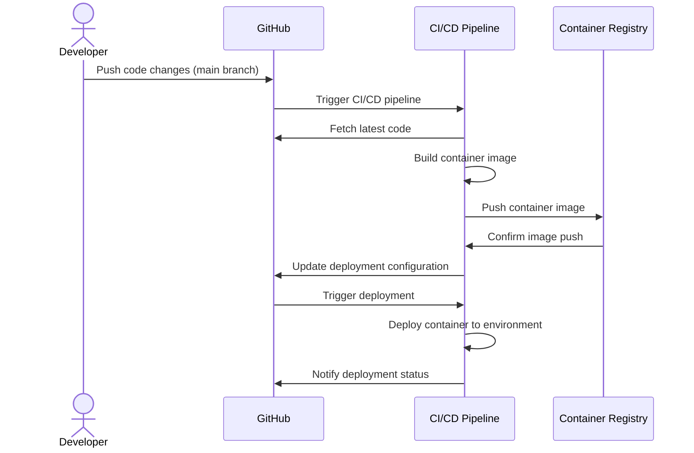

```mermaid
sequenceDiagram
  actor Developer
  participant GitHub
  participant CICD as CI/CD Pipeline
  participant Registry as Container Registry

  Developer->>GitHub: Push code changes (main branch)
  GitHub->>CICD: Trigger CI/CD pipeline
  CICD->>GitHub: Fetch latest code
  CICD->>CICD: Build container image
  CICD->>Registry: Push container image
  Registry->>CICD: Confirm image push
  CICD->>GitHub: Update deployment configuration
  GitHub->>CICD: Trigger deployment
  CICD->>CICD: Deploy container to environment
  CICD->>GitHub: Notify deployment status
```
