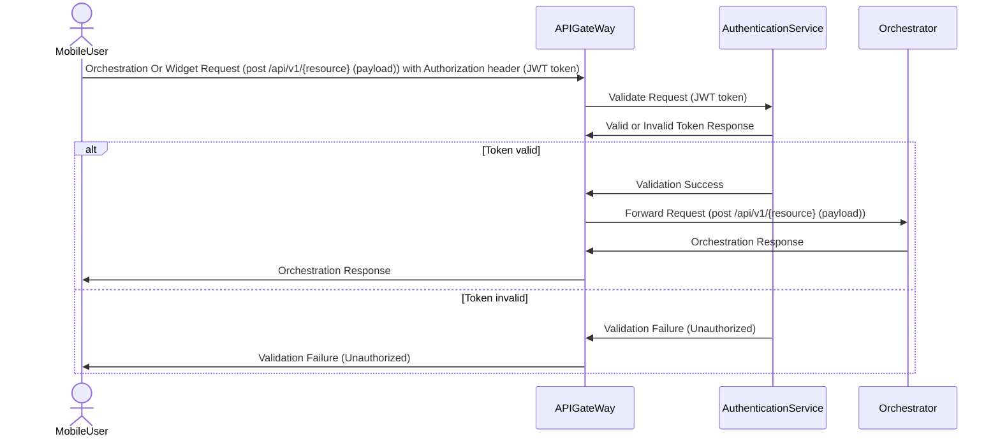

```mermaid
sequenceDiagram
  actor MobileUser
  participant APIGateWay
  participant AuthenticationService
  participant Orchestrator

  MobileUser->>APIGateWay: Orchestration Or Widget Request (post /api/v1/{resource} (payload)) with Authorization header (JWT token)
  APIGateWay->>AuthenticationService: Validate Request (JWT token)
  AuthenticationService->>APIGateWay: Valid or Invalid Token Response
  alt Token valid
    AuthenticationService->>APIGateWay: Validation Success
    APIGateWay->>Orchestrator: Forward Request (post /api/v1/{resource} (payload))
    Orchestrator->>APIGateWay: Orchestration Response
    APIGateWay->>MobileUser: Orchestration Response
  else Token invalid
    AuthenticationService->>APIGateWay: Validation Failure (Unauthorized)
    APIGateWay->>MobileUser: Validation Failure (Unauthorized)
  end
```