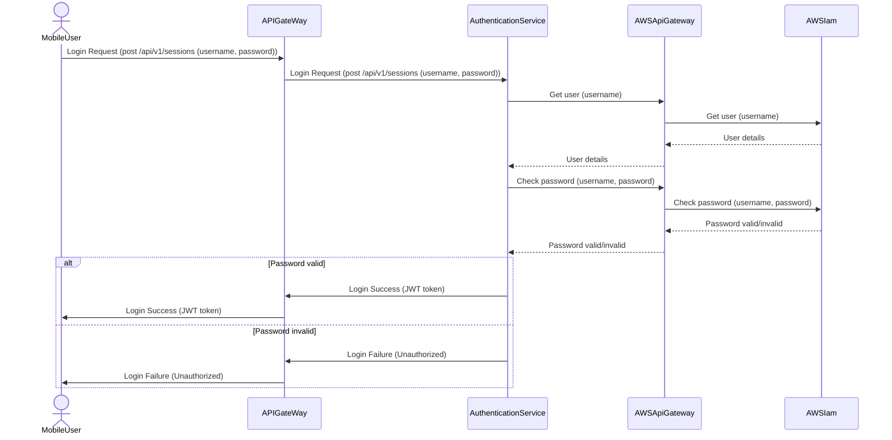

*All username password can be set as access_key_id and secret_access_key for an API login*

```mermaid
sequenceDiagram
  actor MobileUser
  participant APIGateWay
  participant AuthenticationService
  participant AWSApiGateway
  participant AWSIam

  MobileUser->>APIGateWay: Login Request (post /api/v1/sessions (username, password))
  APIGateWay->>AuthenticationService: Login Request (post /api/v1/sessions (username, password))
  AuthenticationService->>AWSApiGateway: Get user (username)
  AWSApiGateway->>AWSIam: Get user (username)
  AWSIam-->>AWSApiGateway: User details
  AWSApiGateway-->>AuthenticationService: User details
  AuthenticationService->>AWSApiGateway: Check password (username, password)
  AWSApiGateway->>AWSIam: Check password (username, password)
  AWSIam-->>AWSApiGateway: Password valid/invalid
  AWSApiGateway-->>AuthenticationService: Password valid/invalid
  alt Password valid
    AuthenticationService->>APIGateWay: Login Success (JWT token)
    APIGateWay->>MobileUser: Login Success (JWT token)
  else Password invalid
    AuthenticationService->>APIGateWay: Login Failure (Unauthorized)
    APIGateWay->>MobileUser: Login Failure (Unauthorized)
  end
```